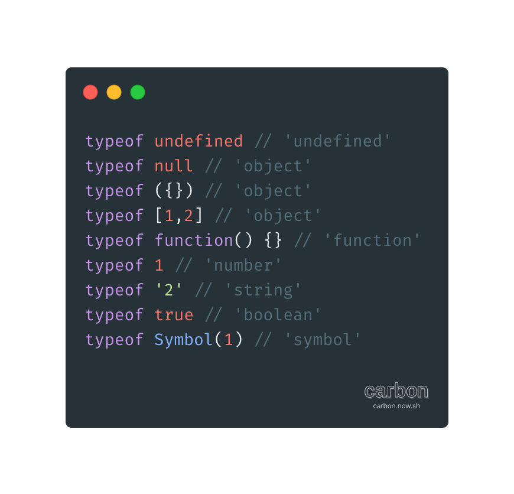

# typeof

>文章大部分内容来自网络,因能力问题没有去探究typeof的底层实现,所以有很多不理解的地方

在JavaScript第一版中,使用的是32位系统,为了性能考虑使用低位存储变量的类型信息.
[变量除了值为还包含了类型tag]
-	000	object
-	1		int[这里不应该是001么]
-	010	float
-	100	string
-	110	boolean

有2个值比较特殊:
-	null:	对应机器码的Null指针,bit位都是0
-	undefined: 用-2^30表示

[这里是typeof的实现](https://dxr.mozilla.org/classic/source/js/src/jsapi.c#333)
```C
JS_PUBLIC_API(JSType)
JS_TypeOfValue(JSContext *cx, jsval v)
{
    JSType type = JSTYPE_VOID;
    JSObject *obj;
    JSObjectOps *ops;
    JSClass *clasp;

    CHECK_REQUEST(cx);
    if (JSVAL_IS_VOID(v)) {  // (1)
        type = JSTYPE_VOID;
    } else if (JSVAL_IS_OBJECT(v)) {  // (2)
        obj = JSVAL_TO_OBJECT(v);
        if (obj &&
            (ops = obj->map->ops,
             ops == &js_ObjectOps
             ? (clasp = OBJ_GET_CLASS(cx, obj),
                clasp->call || clasp == &js_FunctionClass) // (3)
             : ops->call != 0)) {
            type = JSTYPE_FUNCTION;
        } else {
            type = JSTYPE_OBJECT; 
        }
    } else if (JSVAL_IS_NUMBER(v)) { // (4)
        type = JSTYPE_NUMBER;
    } else if (JSVAL_IS_STRING(v)) { // (5)
        type = JSTYPE_STRING;
    } else if (JSVAL_IS_BOOLEAN(v)) { // (6)
        type = JSTYPE_BOOLEAN;
    }
    return type;
}
```
1)	判断是不是undefined
2)	判断是不是对象
3)	判断是不是可执行对象
4)	判断是不是number
5)	判断是不是string
6)	判断是不是boolean

由于Null指针的bit位都是0,所以null被判断为object
```JavaScript
typeof null === 'object'
```

在ES6中有关于修复此Bug的提议[关于修复此Bug的提议](http://wiki.ecmascript.org/doku.php?id=harmony),但是被无情的否决了.[可能是为了兼容现有的代码吧].至此其从bug变为feature😂

这是JavaScript引擎最初的一个bug,现在的JavaScript引擎已经不这么实现了.

### 实践


### TODO
1.	探究V8是如何实现typeof的,尤其是ES6新增了symbol类型
2.	探究undefined在底层是如何表示的[这里猜测其可能是和number类型的NaN采用一样的表示方法]
