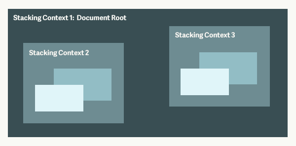
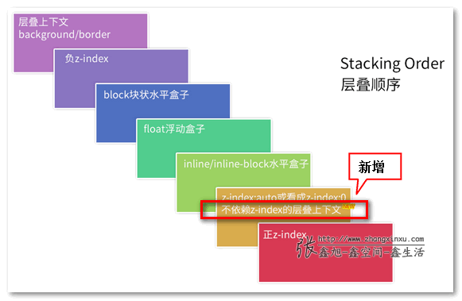
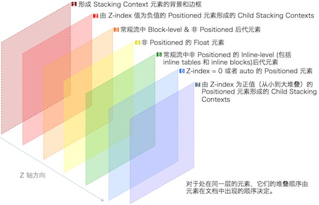

# Stacking CSS层叠关系

我们看到的网页是一个2D平面,但是实际在浏览器渲染时将DOM以3D纬度渲染,这是定位元素会覆盖在文档流内元素上的原因(类似PS图层).

这篇文档介绍的内容就是关于DOM的各种覆盖关系.
了解这些有助于实现布局。而不是盲目的调整z-index.

文档涉及到2个概念,1个规则.

### 概念

##### 概念一: **Stacking Context 层叠上下文**
类似**块级格式化上下文TODO**,Stacking Context规定了其上下文内元素在Z轴方向上的排列规则并且上下文间相互独立.

上面的概念比较抽象,可以被总结为👇2点:
1.	DOM元素的层叠关系在同一个Stacking Context内比较才有意义.
2.	不同Stacking Context中DOM元素的层叠关系依赖于其产生Stacking Context的父元素.不由自身决定.

TODO Demo

这样的元素会产生Stacking Context.
-	**根文档元素(html)**
- **position的值为absolute|relative且z-index的值不为auto的元素**
- **position的值为fixed|sticky的元素**
- **flex盒子的子元素即flex-item,且z-index不为auto**
- **grid容器的子元素,且z-index不为auto**
- **opacity小于1的元素**
- **mix-blend-mode属性不为normal的元素**
- **以下任一属性不为none的元素**
	- **transform**		
	- **filter**		
	- **perspective**
	- **clip-path**
	- **mask|mask-imamge|mask-border**
- **isolation属性为isoable的元素**
- **-webkit-overflow-scrolling属性值为touch的元素** 
- **will-change值设定了任一属性并且此属性在non-initial( 非初始值 )值时会创建Stacking Context的元素**
 	(可以参考这篇文章)[https://dev.opera.com/articles/css-will-change-property/]
- **contain属性值为layout,paint或者包含他们其中之一合成值**

##### 概念二: **Stacking Level 层叠水平**
Stacking Level决定了在同一个Stacking Context内元素在Z轴上的排列顺序.
- **同一个Stacking Context内的元素,Stacking Level高的显示在前面**
- **不同Stacking Context内的元素,向上查找直到其某个祖先在同一个Stacking Context内,由该祖先的Stacking Level决定**

tips:
	需要注意的是z-index并不代表Stacking Level,z-index值大的元素也并不是总显示在前面.
	z-index只有在定位元素|flex-item元素上才会影响Stacking Level.

### 规则

##### Stacking Order 层叠顺序
层叠顺序定义了元素的层叠水平.

下面的图片是在张鑫旭blog上拔下来的,其对CSS3新产生的层叠上下文进行了补充

下面的图对每个层叠水平解释的比较详细,但是缺少了对CSS3新产生的层叠上下文的补充

额外的一点是:
对层叠水平相同的元素而言,后面排列的DOM元素会覆盖前面排列的DOM.

### Demo
下面是我验证层叠上下文的时候写的[Demo地址](https://github.com/thaloy/Demo/tree/master/HTML_CSS).

### 文档参考
1. [层叠上下文](https://developer.mozilla.org/zh-CN/docs/Web/Guide/CSS/Understanding_z_index/The_stacking_context)	
2. [深入理解CSS中的层叠上下文](https://www.zhangxinxu.com/wordpress/2016/01/understand-css-stacking-context-order-z-index/?shrink=1)
3. [CSS重要的层叠概念](https://mp.weixin.qq.com/s/xqGtmbvs7H59hnWP2ZLfbA)

