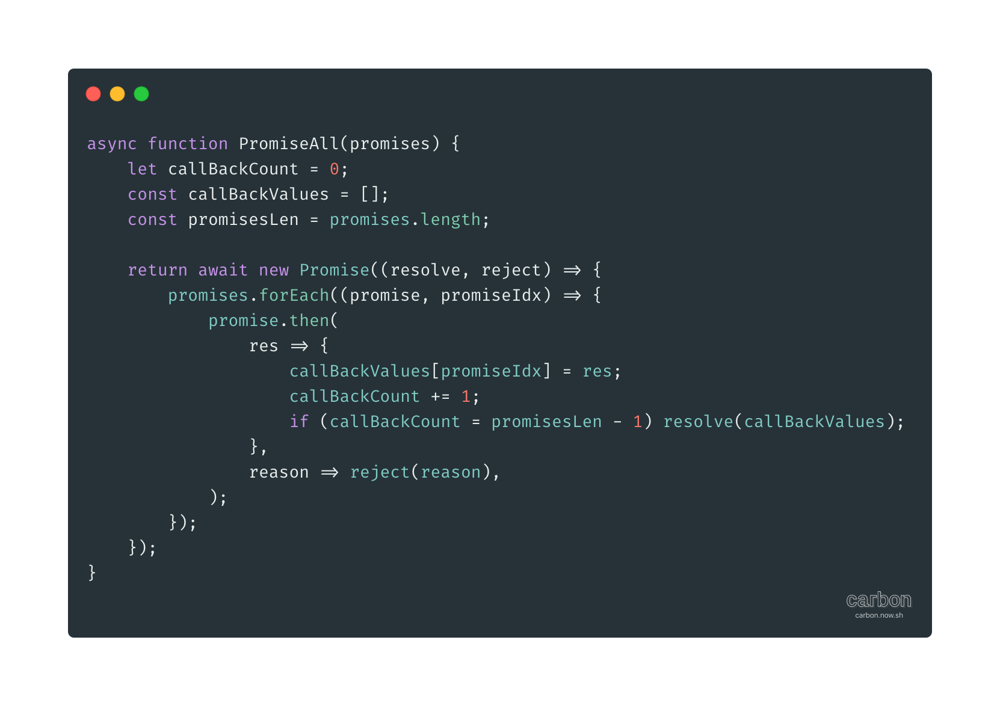
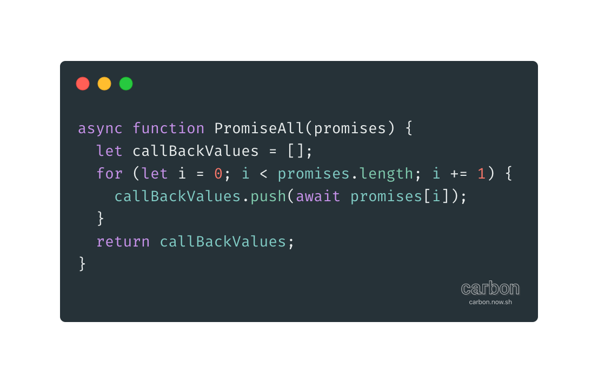
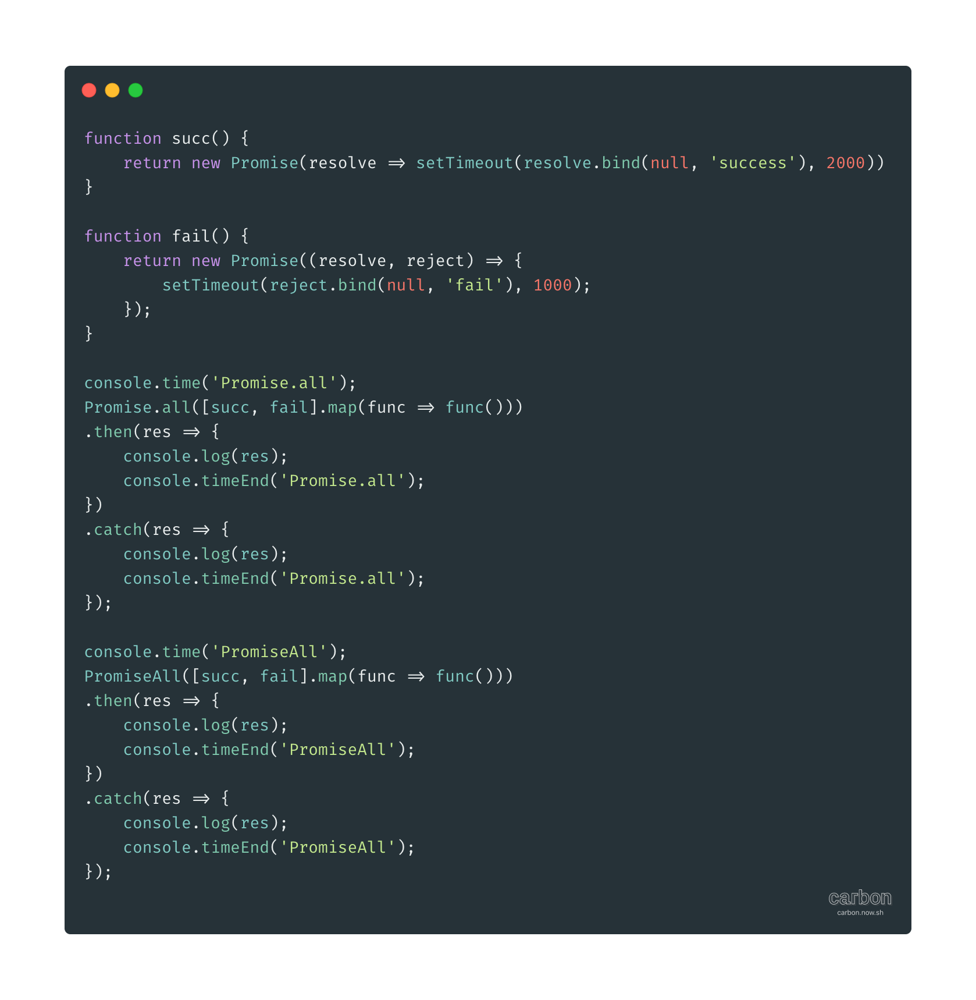

# 使用Async实现Promise.all

时间:	2020/04/17
背景:	小伙伴们正在'侃'面试题,突然看到个面试题**用Async实现Promise.all**,好像有点意思.
实现:
**V1**

上面的是一个Promise.all的实现,但和其他Promise.all的实现没差.
我想面试官想要的实现应该不是这样子的...

**V2**
想了半天也没出怎么实现!
按照我对generator+co的理解,实现Promise.all是不可能的事情.
因为generator的调度是通过co的递归流程控制的,即在promise.then里调用next的promise.then.
这就会造成回调one by one串行.

你可能会认为JavaScript单线程,所有的回调都是串行.You are right!!!
解释下这里的串行是按照promises(Promise.all的参数)数组的顺序one by one执行的.

还没懂?相信下面的例子一定能让你理解.
2个同时发出的异步请求分别为Promise1和Promise2.
其中:
Promise1 2s后成功
Promise2 1s后失败
Promise.all会在1s后以rejected状态执行回调
generator+co会在2s后以rejected状态执行回调
当Promise1的状态有了变化后co才会控制执行Promsie2的回调.

据说Async是generator+co的糖.
应该没什么区别吧.
按照当前理解实现一下,代码如下:

验证下"""""""""""""""""""""""""""""""""

和我理解的一样.

禀着可能未找到正确实现的态度,google一下其他人的实现.
找到一篇[文章](https://juejin.im/post/5d56f89b518825415d0608be)和我的实现差不多
```JavaScript
async function asyncAlls(jobs) {
  try { // 这个try catch就比较尴尬了...
    // 循环执行 
    let results = jobs.map(async job => await job) // 这里本人没看懂? 目前认为是不必要的.
    let res = []
    // 组合数组
    for (const result of results) {
      res.push(await result)
    }
    return res
  } catch (error) {
    throw new Error(error)
  }
}

// 作者：噫酱永不放弃
// 链接：https://juejin.im/post/5d56f89b518825415d0608be
// 来源：掘金
// 著作权归作者所有。商业转载请联系作者获得授权，非商业转载请注明出处。
```
tips:	看了下评论(爱好,因为读评论有的时候可以帮助理解文章内容).有部分人讲实现不是并行的(这里本人不是很懂'并行'指的是什么).

看起来我理解是正确的,使用Async来实现Promise.all是不可能的.
我想面试官这么问会更合理吧:
**请使用Async函数实现并发的异步操作,按照其发送请求的顺序,执行回调函数**

这是有意义的,举个例子吧
比如添加购物车...对同一个按钮的多次点击操作.
保证回调按照发送请求的顺序执行就比较重要了.
否则的话,如果你第2次点击回调在第1次点击回调前执行,这样前/后端数据就不一致了.
我司使用前端数据同步后端,所以这类问题影响 用户体验而非结算时金额差异.

