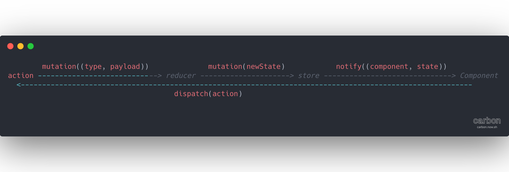

# 为什么需要使用Redux

**Redux**定义为一个JavaScript的状态管理容器, 其目的在于清晰的描述状态的变更

在我看来其不光是一个**DataManager**系统, 更是一套限制开发者开发方式的约定, 通过**定义好的约定关系**能让代码更加可读, 简洁

### Redux的功能

- **清晰的行为描述**
- **开发模式的约定**

### 清晰的行为描述

我们知道**React**组件的通信方式有很多种, 状态提升，发布/订阅，Refs，甚至于传递一个对象(可以是observable对象)

正是由于组件间灵活的通信方式，让管理App的状态变得困难

即使按照**React**的约定使用props和callback(自顶向下传递数据), 跨层级props和callback也会让App的状态变得混乱, **React**提供了**render props**的方案来处理跨层级的状态共享，但是这又在父组件内耦合了多余的逻辑

这就是**Flux**架构诞生的原因(按照我的理解，每个**React**组件都是一个单独的MVX模式, 其数据流向会变成一个复杂的图)

会变得复杂的原因在于每个组件都有自己的Model，**Redux**通过提升这个Model到全局，使得数据流向更简单, 组件->State->组件

对组件的维护也更加简单, 迭代的时候我们只需要注意输入(组件订阅的State)/输出(组件影响的State), 更容易编写测试用例

同时**Redux**通过reducer**声明式**的更改状态, 即: 不可以随便的进行状态的变更，需要预先通过reducer`声明`状态变更的逻辑，这也避免了隐士改变状态产生的bug

**Redux**通过抽象action来描述行为/功能, 基于type我们能更加清晰的了解到App现存的行为, 可以减少重复的功能

##### Redux的数据流向


### 开发模式的约定

通过这种约定好了的开发模式，可以通过`middleware(redux)`进行更多的统一处理，让代码更清晰，比如可以对action做发布/订阅，同一个action对应了2个逻辑(`核心逻辑`, `埋点`)逻辑, 这样`埋点`逻辑就不会内联入核心逻辑，验证`业务逻辑`和`数据逻辑`的过程可以有效的分开，保证无相互影响

```JavaScript
// 一种实现思路
function click() {
  ...
}

function log() {
  ..
}

action: { type: 'CLICK', payload: [click, log] };

// 这样逻辑更加清晰相较于下面的例子

function click() {
  ...click;
  ...log;
}
```
**redux-sage**就是来做这个事情的
