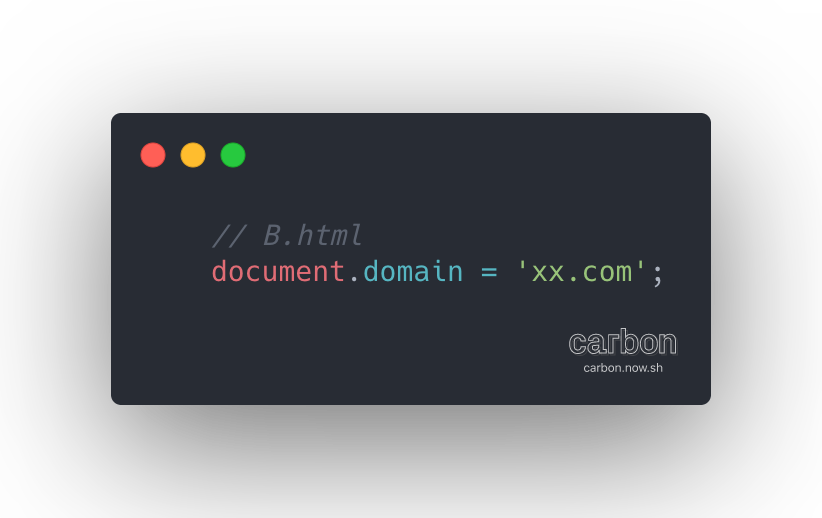

# 跨域

@time 2020/05/05

### 同源策略

> 同源策略是一个重要的安全策略，它用于限制一个 origin 的文档或者它加载的脚本如何能与另一个源的资源进行交互。它能帮助阻隔恶意文档，减少可能被攻击的媒介。---MDN

同源策略禁止了脚本访问不同源的文档资源

- dom 操作
- xhr
- ...

### 如果没有同源策略会怎样?

e.g.
某钓鱼网站内嵌了某个直播平台(iframe)
这样攻击者就能通过钓鱼网站的脚本获得你在该直播平台的登陆信息(一般平台都有免密登陆,存放到 localStorage 或 cookie 中)
攻击者就可以代替你给某'女主播'刷礼物啦

tips:
通过 X-Frame-Options 和 CSP 可以设置网页是否可以被 iframe 嵌入

### 什么是同源

同源: 协议,域名,端口号一致
这里的域名指的是document.domain的值,其可以被更改,可能会和你在浏览器地址栏上面看到的不一致,后面会提到TODO

tips:
默认 http 端口为 80,https 端口为 443

### 为什么要跨域?

我这里将跨域分为 2 种类型

- xhr/fetch 的跨域

实际上我们的 xhr/fetch 请求一般都是跨域的

企业开发中 Server 的服务被部署到不同的机器上,通过配置当前域名的代理服务(nginx)将 request 映射到对应机器上(ip+端口)
实际上这就是在跨域

老实讲 xhr 跨域使用反向代理的方式就足够了(这是我当前的理解)
如果不想配置 nginx 或者基于一些其他原因使用 cors 也是可以满足需求的
但是对于一些其他的 xhr 跨域(jsonp),我确实想不到这种跨域方式的必然性
e.g.
百度搜索是应用jsonp方案的,但是我至今没有想清楚是基于什么样的原因采用jsonp😂

- 不同域名间的信息共享

典型的应用场景是不同域名间共享用户的登陆信息(类似SSO的效果)
e.g.
某公司提供了2个不同域名的页面,希望用户登陆A页面后,从(A页面中跳转到)/(打开)B页面的时候会携带这用户的登陆状态
这个时候就可以利用一个另外的页面C,将用户的登陆信息存入页面C中
实现不同域名间的登陆信息共享

### 跨域的方案

下面提到的某些方案只是用来扩展思路的,并不建议使用它们来实现跨域(webSocket等),它们有其他的应用场景或者已经被历史淘汰
比较推荐的跨域方式(正/反向代理,cors,window.postMessage,jsonp),我是真的不想把jsonp放进去

- cors
TODO 单独整理

- jsonp
TODO 单独整理

- **server代理**

正/反代理的区别仅仅在于对于用户来讲你代理服务是不是隐藏的(你知不知道你在用代理服务)

  - **正向代理**
  代理服务不对用户隐藏,一般我们开发中使用到的环境变更的方式都属于正向代理 
    - **charles的remote**
    - **webpack-dev-server**
    - **vpn**

  - **反向代理**
  代理服务对用户隐藏(你以为访问的是A,实际上是通过代理服务转发过去的)
    - **企业中的nginx**

- postMessage

TODO 单独整理

- webSocket

TODO 单独整理 链接到WebSocket

- **document.domain**

前面提到过浏览器域名'同源'并不是指我们在地址栏看到的域名,是由`document.domain`提供的,通过修改这个值可以让本不'同源'的A,B2个页面达到同源
e.g.
```JavaScript
// A.html
// host = 'a.xx.com'
document.domain = 'xx.com'

// B.html
// host = 'b.xx.com'
document.domain = 'xx.com'
```
通过上面的设置可以让A和B'同源'

修改`document.domain`的值有以下需要注意的点

- **其值只能是当前域名/当前域名的父域名**

- **修改`document.domain`会将当前文档的端口号(这里指的是浏览器同源策略时使用到的端口号,并没有修改http的端口号)设置为null**

e.g.
'同源'的2个A,B页面,A修改document.domain为当前域名,浏览器会有关于跨域的异常,这是因为A的端口号为null,而B的端口号为5000
```JavaScript
document.domain = 'a.xx.com';

const iframe = document.createElement('iframe');  

iframe.src = 'http://a.xx.com:5000/domain/B.html';

iframe.onload = function() {
  console.log('load');
  console.log(iframe.contentWindow.window);
}

document.body.appendChild(iframe);

```
所以相应的B页面也要修改其document.domain让其端口号为null

###### 实现思路
1.  让属于父子域名/兄弟域名的2个域名'同源',通过设置document.domain为父域名
2.  ...没了...

###### 具体代码




- **location.hash**

**location.hash**更改的时候浏览器不会刷新页面,不会像server发送请求,同时会响应onhashchange事件

###### 实现思路

1.  A,B,C3个页面, 其中A,B同源, C其他源
2.  A通过iframe嵌入C页面,并且传入不同的hash
3.  C响应hash,同时将处理结果通过hash传入B页面 
4.  B页面和A页面同源很容易相互传递数据,这个时候因为A页面是无法捕捉到B页面的onload事件的,所以需要B去更改A的hash(触发onhashchange)或者可以考虑在A中去轮寻一个值,在B中去更改这个值
5.  2中方案我采用轮训的方式,因为触发onhashchange随便google就可以了

**采用方案2的另外的原因是,这里的跨域数据传递和hash并没有什么关系,本质上是同源的2个文档间的数据传递,非同源的C页面其实就是一个共享信息的本地文件,这种方案更接近本质,与hashchange无关**

###### 具体代码

A页面地址http://a.xx.com:4000/hash/A.html
B页面地址http://a.xx.com:4000/hash/B.html
C页面地址http://c.xx.com:4001/hash/C.html
(更改hosts)


- **window.name**

**window.name**是浏览器窗口的一个特殊属性(默认为''),其特殊的地方在于通过脚本设置的值,不会随着刷新而更改
```JavaScript
window.name = 'name';
// 刷新
console.log(window.name); // name
```
这很好理解，因为其表示的是窗口的名字,刷新什么的变化的是窗口的内容而不是这个窗口

###### 实现思路

1.  3个页面A,B,C. 其中A,B同源.  C其他源
2.  C中更改window.name
3.  这个时候A是无法获得C的window.name的因为不同源,但是A可以更改iframe的指向从C到B,这个时候A和B是同源的,并且因为是同一个iframe的window,所以其window.name被保留
4.  通过iframe.contentWindow.name获得数据

######  具体代码

A页面地址http://a.xx.com:3005
B页面地址http://a.xx.com:3005/B
C页面地址http://c.xx.com:3006
(更改hosts)


### Code

上述所有code都在TODO这个git仓库
