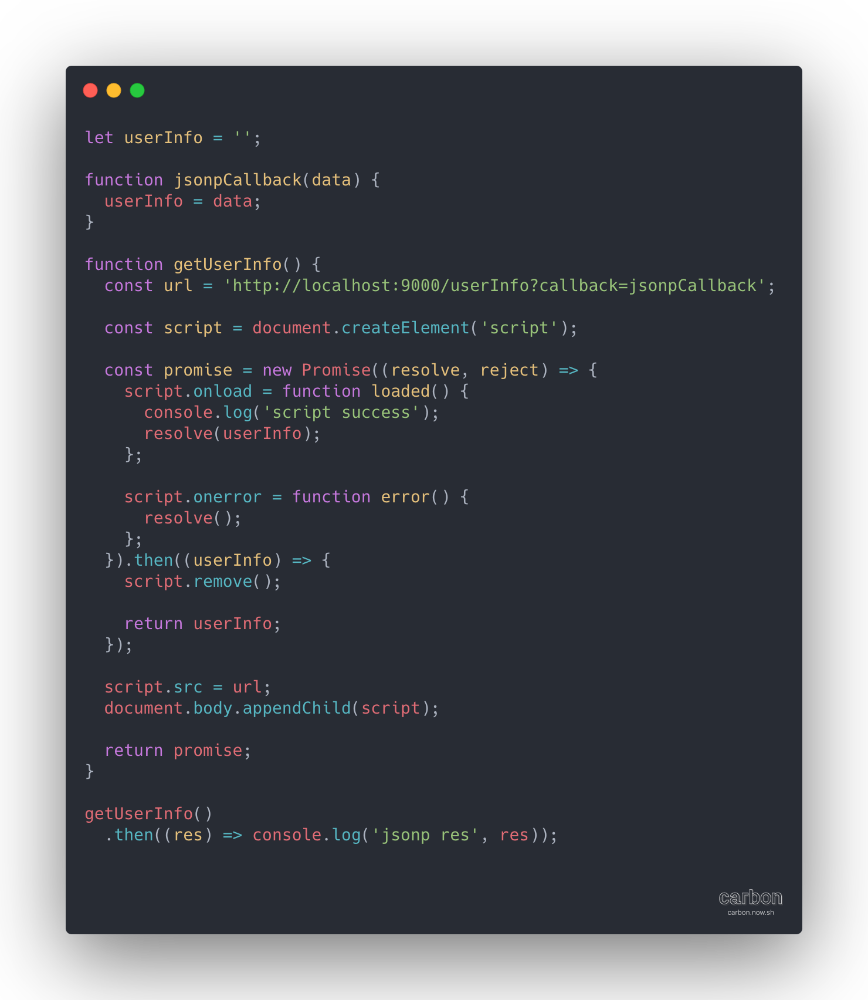
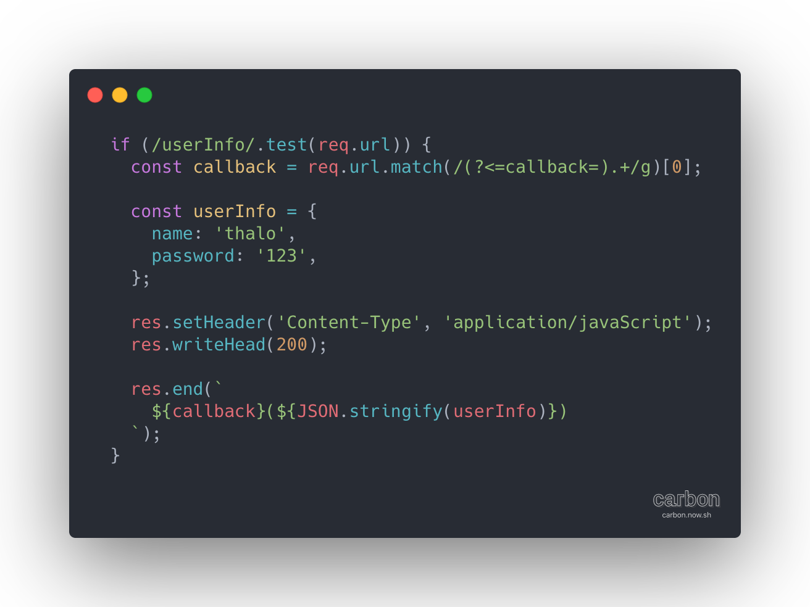

# Jsonp

`@time 2020/05/29`

### 原理

- **src属性可以加载外域资源**

- **script加载完资源后会执行资源**

基于以上2点我们可以和后端(预先约定/通过接口约定)好`数据的变量名`, 后端返回
```JavaScript
window.userInfo = {
  name: 'thalo',
  password: '123',
};
```
这样的格式, 这样我们就可以在`script.onload`中访问到`window.userInfo`了

如果想实现`私有化数据`的话，可以通过`callback(userInfo)`这样的形式，预先定义/通过接口约定好`callback`, 后端返回
```JavaScript
// 后端
jsonpCallback({
  name: 'thalo',
  passsword: '123',
});
```
前端需要预先声明出`jsonpCallback`
```JavaScript
function jsonpCallback(userInfo) {
  return new Promise(resolve) {
    resolve(userInfo);
  }
}
```

### 应用场景

不清楚`Jsonp`有什么适合的应用场景, 按照我的理解可以使用`Jsonp`的地方都可以被`Nginx`替换, 不明白这个技术诞生的背景

`百度搜索框`是一个使用类似`Jsonp`技术的产品, 其接口返回值为`callback(data)`的形式，但是其接口并没有跨域

`webpack`, webpack的引导文件被命名为`webpack_jsonp_callback` TODO

### 实现

通过接口向服务端传送`callback`, 服务端返回`callback(data)`

**client**

**server**

