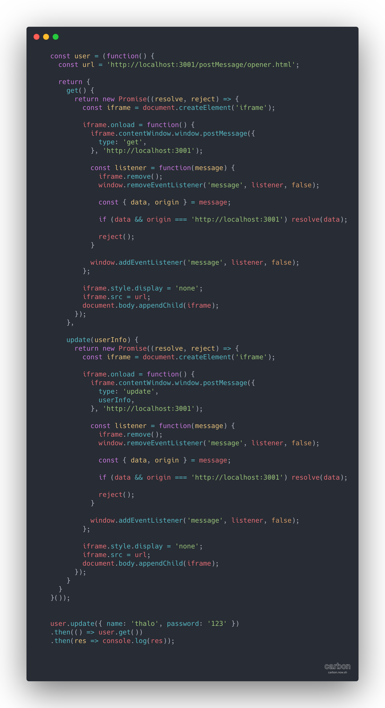
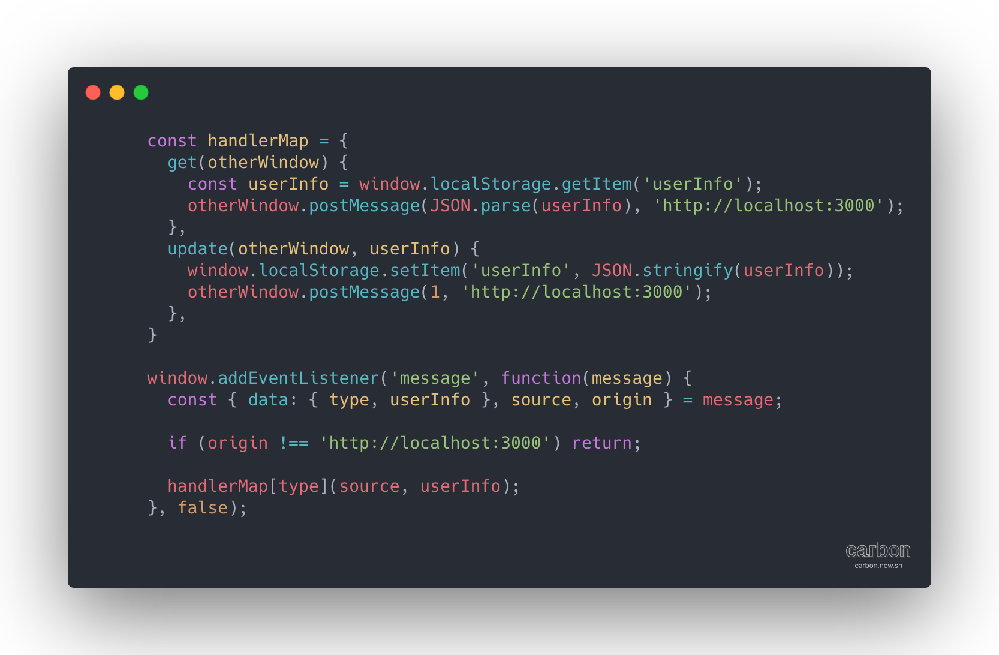

# postMessage

`@time 2020/05/27`

`postMessage`是`W3C`为了安全解决`跨域共享`这类需求场景而提供的`API`, 其可以代替`document.domain`, `window.name`, `window.location.hash`来实现不同域名间共享信息

### API

```JavaScript
// 发送消息 origin页面
(this: targetWindow, message: any, targetWindowOrigin: string, transfers: Transferable[]) => void

// 响应消息 target页面
window.addEventListener('message', function(event) {})
```

- `this`
  接受`message`的目标窗口

```JavaScript
<iframe src="" />
iframe.contentWindow.window.postMessage(...);
```

- `message`
  目标窗口接受到的数据, 会被挂载到`event`上被响应

```JavaScript
const message = event.data;
```

- `targetWindowOrigin`
  对目标窗口`origin`的限制, 可以是`*`和`protocal://domain:port`, 只有满足限制才可以传送`message`
  - `*`
    对目标窗口`域名`无限制

  - `protocal://domain:port`
    目标窗口的`protocal`,`domain`,`port`必须一致
    ```JavaScript
    window.location.origin === 'protocal://domain:port
    ```

- `transfers`
  `MDN`上说是`Transferable`对象构成的可遍历集合, 目前没懂`Transferable`是什么

但是,`MessageChannel`实例化出来的 2 个端口满足`Transferable`结构

```JavaScript
// origin
const { port1, port2 } = new MessageChannel();

window.postMessage('mesage', '*', [port1]);

// target
window.addEventListener('message', function (event) {
  const { ports: [port1] } = event;
});
```

### 常用 event 的属性

- `event.data`
  对应着`message`

- `event.ports`
  对应着`transfers`

- `event.origin`
  发送`message`窗口的`window.location.origin`

- `event.source`
  发送`message`窗口的窗口实例(`window`)

### 特点

- `安全`
  - `发送message的窗口`
    可以通过`targetWindowOrigin`参数指定接收`message`的`origin`
  - `接收message的窗口`
    可以通过`event.origin`判断发送`message`窗口的`origin`是不是在其白名单内

### Demo

下面 🌰 是通过`postMessage`实现不同域名间信息共享

应用场景是多个域名间`SSO`

- **originWindow**


- **targetWindow**

